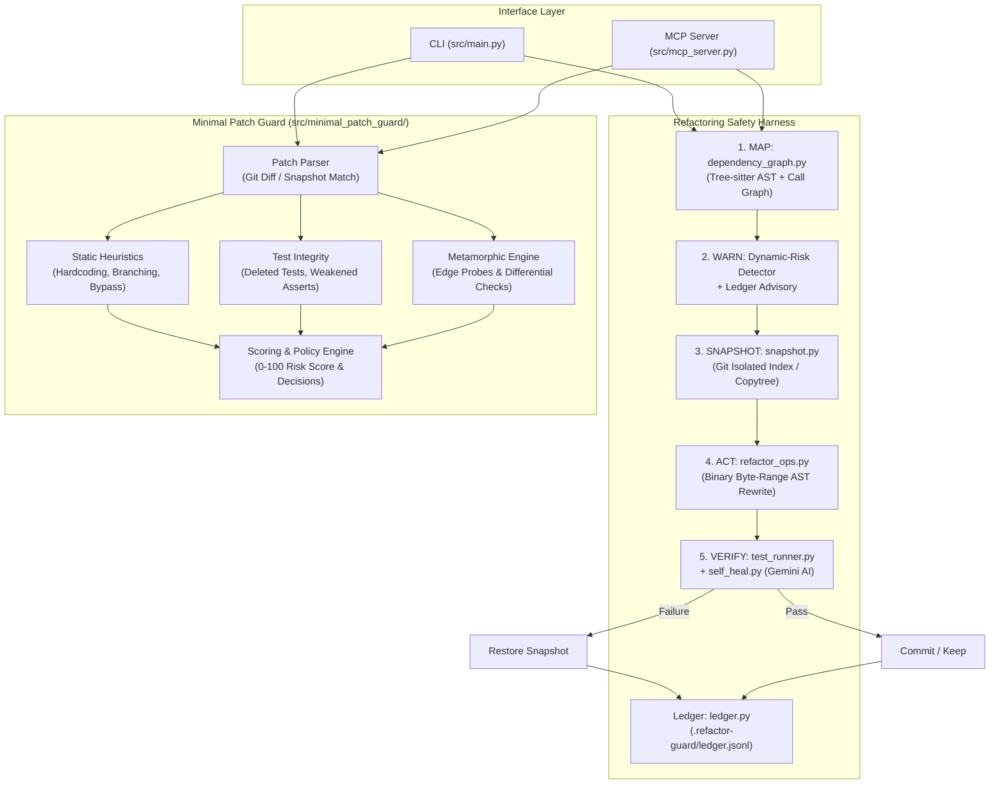
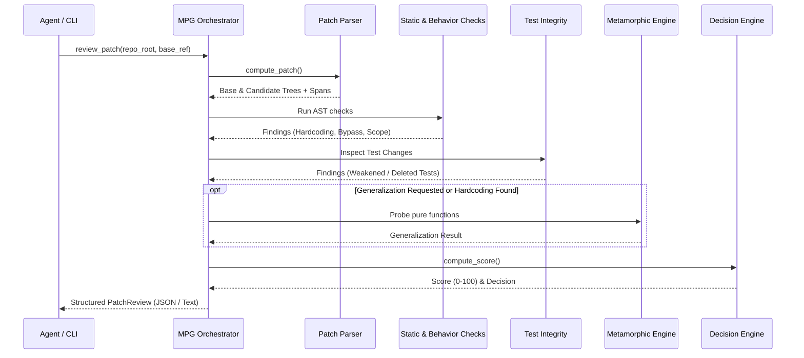

# Refactor Guard: System Architecture

Refactor Guard is an agentic code intelligence safety harness designed to prevent broken refactorings, catch stale dynamic references, and gate code modifications through automated verification, snapshot rollback, and patch minimality analysis.

---

## High-Level Architecture

The Refactor Guard platform consists of two cooperating subsystems:
1. **The 5-Step Refactoring Harness**: Safely plans and applies AST-level code changes (`rename`, `extract-function`, `move-symbol`) with rollback.
2. **Minimal Patch Guard (MPG)**: Reviews working tree diffs against a base revision to flag over-fitting, lazy hardcoded fixes, test weakening, and scope bloat.

---

## 1. The 5-Step Refactoring Harness

### Step 1: MAP (`src/dependency_graph.py`)
- Uses **Tree-sitter** grammars (`tree-sitter-python`, `tree-sitter-javascript`) to parse target codebases into concrete syntax trees.
- Identifies **static references**:
  - Python: Function/class definitions, function calls, imports (`from x import y`, `import x`), attribute accesses.
  - JavaScript/TypeScript: Function declarations, variable declarations, method calls, property identifiers, `require()` / ES module imports.
- Computes **transitive blast radius** via `networkx.DiGraph` traversing direct and indirect caller modules.
- Pre-flight query to `ledger.py` checks for prior successes on the target symbol.

### Step 2: WARN (`src/main.py` + `src/ledger.py`)
- Detects **dynamic-risk references** (where the symbol name appears inside string literals, e.g. `getattr(mod, "func_name")`, `obj["propName"]`, or configuration strings).
- Because static refactoring cannot safely rewrite dynamic strings without semantic drift, these locations are flagged to the user *before* any file modifications occur.
- Queries `ledger.jsonl` for previous rolled-back attempts:
  - If prior failures exist, surfaces failure dates and root causes.
  - Tags any current dynamic-risk file implicated in a previous rollback as `(REPEAT OFFENDER)`.

### Step 3: SNAPSHOT (`src/snapshot.py`)
- Provides a dual-strategy snapshot mechanism:
  1. **Git Repositories**: Fast, zero-copy commit stored on throwaway ref `refs/refactor-guard/<uuid>`.
     - Completely isolated from developer's real staging area via temporary `GIT_INDEX_FILE`.
     - Pre-seeds tree from `HEAD` to ensure files outside `repo_root` are preserved byte-for-byte.
     - Scopes rollback restores strictly to `repo_root` using `git checkout-index`.
  2. **Non-Git Fallback**: Directory copy excluding large directories (`node_modules`, `venv`, `__pycache__`, etc.).
  3. **Windows & Read-Only Resilience**: Employs `_force_remove_tree` and `_force_remove_file` to strip read-only attributes (`0o444`, common on Git object files) during directory deletion and rollback.

### Step 4: ACT (`src/refactor_ops.py`, `src/extract_function.py`, `src/move_symbol.py`)
- **AST Byte-Range Span Replacement**:
  - Rather than applying naive regex across entire files (which risks corrupting comments, docstrings, or unrelated strings), `refactor_ops.py` reads files in binary mode (`rb`) and replaces only verified AST identifier byte ranges in reverse order.
  - Validates span contents against `old_symbol` bytes before writing.
  - Gracefully falls back to word-boundary regex for individual files only if Tree-sitter reports syntax errors (`root_node.has_error`).
- **Function Extraction**: Uses Python AST analysis to compute free variables (parameters) and externally referenced assigned variables (return values).
- **Symbol Moving**: Relocates top-level symbols, creates target files if needed, and rewrites cross-module import paths across the repository.

### Step 5: VERIFY (`src/test_runner.py` + `src/self_heal.py`)
- Executes the project's verification test suite via subprocess (e.g. `pytest -q`, `node --test`).
- If tests pass: Snapshot is deleted and a `SUCCESS` record is logged to the ledger.
- If tests fail:
  1. Optional AI Self-Heal diagnosis is requested from Google Gemini (`gemini-3.6-flash`).
  2. Scans diagnosis against anti-hardcoding heuristic guards.
  3. Re-runs test suite exactly once (bounded retry).
  4. If tests still fail: Instant auto-rollback from snapshot and records `ROLLED_BACK` in the ledger.

---

## 2. Minimal Patch Guard (MPG) Pipeline

Minimal Patch Guard operates on working tree changes before merge or commit:

---

## 3. Language & Runtime Support Matrix

| Operation | Python (`.py`) | JavaScript (`.js`) | TypeScript (`.ts`) | Enforcement |
|---|:---:|:---:|:---:|---|
| **`rename`** | ✅ Full AST | ✅ Full AST | ✅ Full AST | Tree-sitter byte-range spans |
| **`extract-function`** | ✅ Full AST | ❌ Excluded | ❌ Excluded | Python AST flow; exits code 2 on others |
| **`move-symbol`** | ✅ Full AST | ❌ Excluded | ❌ Excluded | Python AST modules; exits code 2 on others |
| **`review-patch`** | ✅ Full MPG | ✅ Static + Scope | ✅ Static + Scope | Generalization probes target Python |
