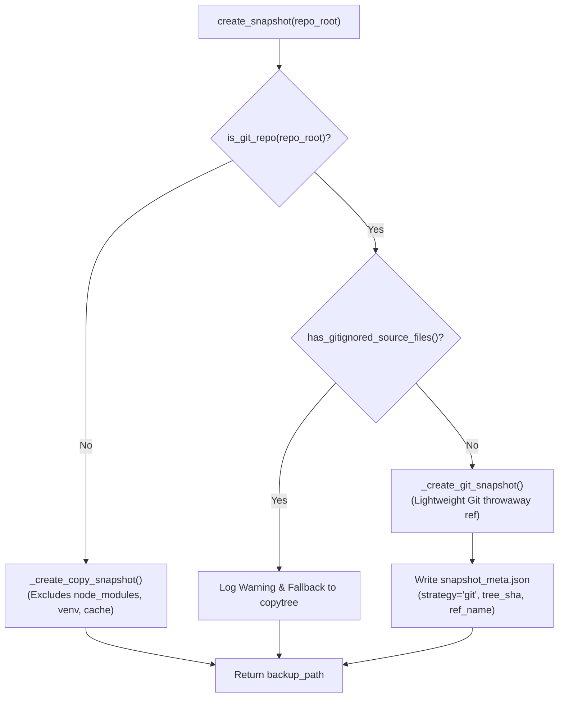

# Snapshot Engine & Audit Ledger

Refactor Guard includes a zero-risk state rollback engine (`src/snapshot.py`) and an append-only audit trail (`src/ledger.py`) to guarantee that failed refactoring attempts never corrupt developer codebases or lose historical context.

---

## 1. Dual-Strategy Snapshot Engine (`src/snapshot.py`)

Snapshotting must be fast, zero-copy where possible, and completely isolated from the developer's working environment.



### Git Snapshot Architecture
1. **Isolated Index (`GIT_INDEX_FILE`)**:
   - Refactor Guard creates a temporary file in the OS temp directory (`rg_snap_idx_<uuid>`) and binds it via `GIT_INDEX_FILE`.
   - The user's actual `.git/index` is **never read or modified**.
2. **Subdirectory Isolation (Seeded Index)**:
   - If `repo_root` is a subfolder of an enclosing monorepo, staging `.` would erase outside files if committed directly.
   - Refactor Guard pre-seeds the temporary index using `git read-tree HEAD` before staging `repo_root`, ensuring all files outside `repo_root` remain byte-identical.
3. **Scoped Rollback (`git checkout-index`)**:
   - Restorations are strictly restricted to `repo_root` using `git checkout-index -f -z --stdin`.
   - Untracked files created during the failed refactoring run are swept and removed without touching untracked files outside `repo_root`.
4. **Zero-Commit Repository Handling**:
   - Freshly initialized repositories without commits (`git init`) are detected via `git rev-parse --verify HEAD`. The `-p HEAD` flag is omitted gracefully.

### Windows & Read-Only Object Resilience
- **The Problem**: Git stores loose object files in `.git/objects/` with read-only permissions (`0o444`). On Windows, standard `shutil.rmtree()` aborts with `PermissionError: [WinError 5] Access is denied`, leaving repositories half-deleted during rollback.
- **The Solution**: Refactor Guard implements `_force_remove_tree` and `_force_remove_file`:
  - Iterates through target entries and clears read-only attributes (`stat.S_IWRITE`).
  - Implements an exponential-backoff retry loop to bypass transient locks from Windows Defender or search indexers.
  - Ensures snapshot restoration and directory cleanup complete cleanly across all operating systems.

---

## 2. Refactor Audit Ledger (`src/ledger.py`)

Refactor Guard records all completed refactoring attempts into `<repo_root>/.refactor-guard/ledger.jsonl`.

### Record Schema

Each line in `ledger.jsonl` is a JSON object with the following fields:

| Field | Type | Description |
|---|---|---|
| `timestamp` | `string` | ISO 8601 UTC timestamp of execution. |
| `operation` | `string` | `"rename"`, `"extract-function"`, or `"move-symbol"`. |
| `symbol` | `string` | Target symbol name. |
| `params` | `object` | Operation arguments (e.g. `to`, `file`, `start_line`, `source`, `target`). |
| `outcome` | `string` | `"success"`, `"rolled_back"`, or `"error"`. |
| `static_files` | `array` | List of files that contained static AST references. |
| `dynamic_risk_files` | `array` | List of files containing dynamic string occurrences of the symbol. |
| `failure_symbols` | `array` | Missing symbol names detected during test runner diagnosis. |
| `test_cmd` | `string` | Command executed for verification. |

### Sample Ledger Record
```json
{
  "timestamp": "2026-09-15T12:30:00Z",
  "operation": "rename",
  "symbol": "compute_total",
  "params": {"to": "sum_items"},
  "outcome": "rolled_back",
  "static_files": ["pkg/mathutils.py", "tests/test_calc.py"],
  "dynamic_risk_files": ["pkg/dynamic_caller.py"],
  "failure_symbols": ["compute_total"],
  "test_cmd": "pytest -q"
}
```

### Pre-Flight Surfacing & Repeat Offender Tracking
- **Fail-Soft Guarantee**: Ledger writes occur strictly after rollback/cleanup is finalized. Exceptions during ledger write never alter the process exit code or disrupt recovery.
- **Repeat Offender Tagging**: In **STEP 2 (WARN)**, if the current dynamic-risk file list intersects with files that contributed to a prior rollback for the same symbol, the CLI warns:
  ```text
  ⚠ PRIOR HISTORY: Symbol 'compute_total' was rolled back 1 time(s) previously.
    Repeat offender file(s) implicated in prior rollback: pkg/dynamic_caller.py
  ```
- **Advisory Only**: Prior failure warnings are informative and never block execution or prompt for manual input.
